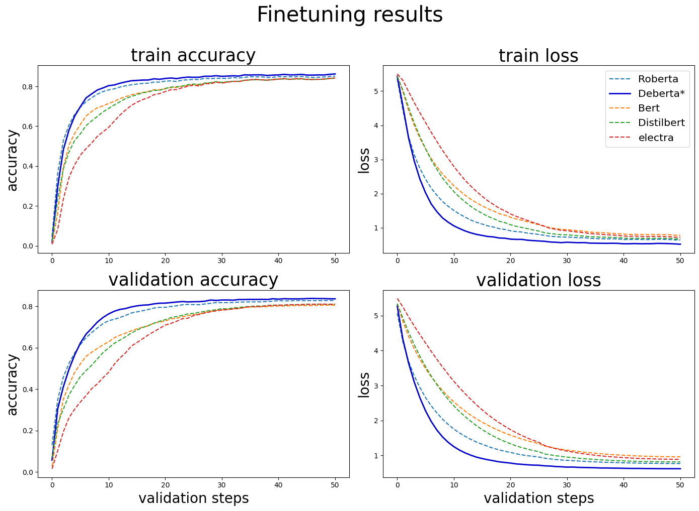
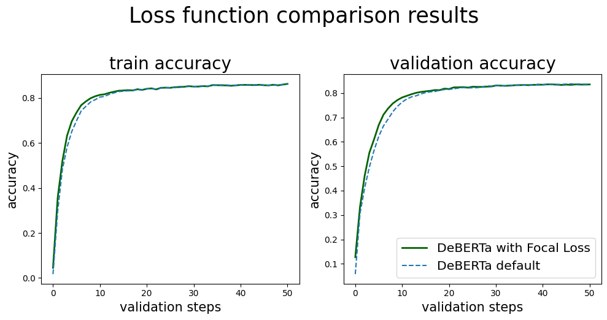

<h1 style="text-align: center;">Transformers compete on imbalanced product classification data</h1>

<h3>Context:</h3>

- The task chosen is to classify product data into its respective "browse node"

- Product data such as "Product name", "Product description", "Brand Name", "Brand Description" is given.

- As seen in E-commerce websites, The number of products existing in each category is highly varied, and this imbalance makes categorization by machine-learning challenging, and interesting.

- Hence, the performance of the amazing transformer models are explored on this imbalanced data.

<h3> details </h3>

- The dataset can can be found in this link. <a href="https://drive.google.com/drive/folders/165k0tlrmcF28n1fz1DVSwXXXAdt5ONZJ?usp=sharing">[link]</a>

- link to resulting publication. <a href="https://ieeexplore.ieee.org/abstract/document/10183484">[link]</a>

<h3>Steps taken in this project:</h3>

1. The dataset is explore and pre-processed. <a href="./Eda_and_preprocessing.ipynb">[EDA and preprocessing]</a>

2. The pre-processed dataset is tokenized 
using **rust** based batchwise tokenization and saved as pickle files. <a href="./tokenization.ipynb">[tokenization]</a>

3. Each transformer is trained using its respective tokensized dataset, the metrics are logged, and then visualized as shown below. <a href="./Training.ipynb">[training]</a> :   

  

 
4. The top performer is retrained using the focal loss, and the improved is shown as below.   

  

______

<h3> References </h3>
[1]&nbsp; Surana S, "Amazon Product Browse Node Classification Data", Kaggle Datasets. <a href="https://www.kaggle.com/datasets/subhamjain/amazon-product-browse-node-classification-data">[link]</a> 
